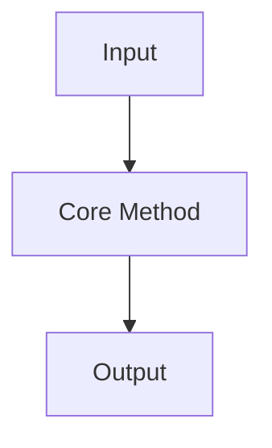

# Deep Reading Template

Use this as the default body for `## 精读记录`. Keep the headings that are useful for the paper and remove headings that would only create filler.

```markdown
## 精读记录

### 精读目标

- 本次精读要解决的问题：
- 输出用途：研究 / 实现 / 项目迁移 / 面试表达 / 审稿式检查
- 当前可靠性：完整 / 部分，缺失原因：

### 论文主问题

- 论文要解决的核心问题：
- 这个问题为什么重要：
- 旧方法的关键限制：

### 核心贡献拆解

| Claim | Evidence | Caveat |
| --- | --- | --- |
|  |  |  |

### 方法重建

- 输入是什么：
- 输出是什么：
- 核心 pipeline：
- 每一步解决什么子问题：
- 方法成立依赖的关键假设：



### 关键公式 / 算法逐步解释

- 公式 / 算法位置：
- 符号含义：
- 每一步在机制上做什么：
- 容易误解的点：

### 实验与证据表

| Experiment | Baseline / Comparison | Metric | Supports | Does Not Prove |
| --- | --- | --- | --- | --- |
|  |  |  |  |  |

### 限制与失败条件

- 作者明确承认的限制：
- 从方法假设推出的潜在失败条件：
- 实验没有覆盖的情况：

### 实现 / 复现风险

- 数据或预处理依赖：
- 参数、训练、数值或工程细节风险：
- 复现时最容易错的地方：
- 可先做的最小验证实验：

### 和已有知识的连接

- 前置知识：
- 相关主题：
- 可沉淀到 `03-Knowledge` 的点：
- 可转成 `11-Review` 的表达或问答：

### 可复述版本

用 1 分钟解释：

> 

用 3 分钟解释：

> 

### 后续动作

- [ ] 待回看：
- [ ] 待补链接：
- [ ] 待验证 / 复现：
```

Rules:

- Write `未验证 / 待回看` instead of guessing.
- Keep claims tied to concrete evidence.
- Prefer short, traceable quotes only when the source location can be recovered.
- Do not create separate notes from this template unless the user explicitly asks.
